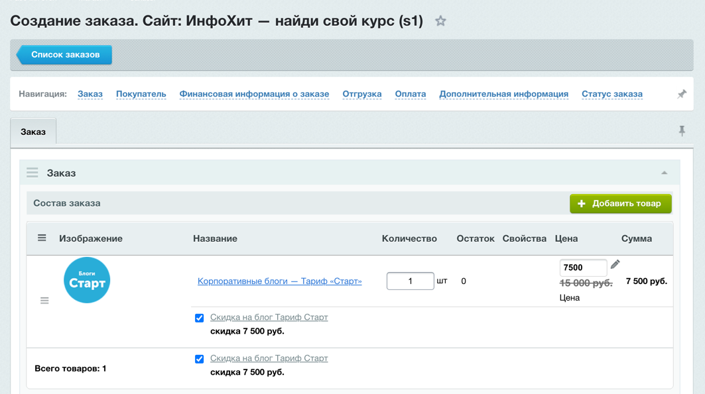
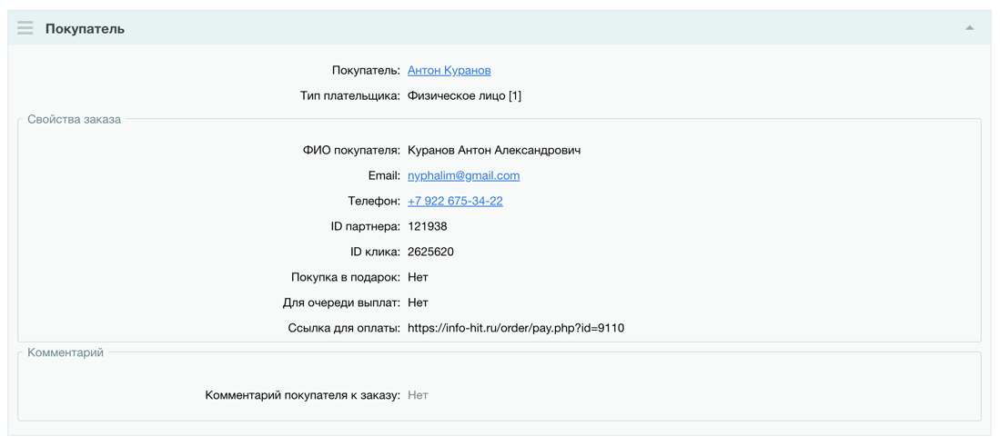

:::note
C 03.04.2025 появилась возможность генерировать ссылку для оплаты услуг ИнфоХит с&nbsp;произвольной суммой.
:::

Этот процесс позволяет исключить необходимость автору/школе самоостоятельно оформлять заказ на сайте.
То есть менеджер может сделать это сам, а рекламодателю отправить просто ссылку на оплату в любой удобный канал связи.

В процессе создания заказа менеджер может предоставить любую уникальную скидку.

## Процесс получения ссылки

1. Заходим в админку сайта и переходим в раздел Магазин > Заказы 
   https://info-hit.ru/bitrix/admin/sale_order.php?lang=ru
2. Нажимаем кнопку "Добавить заказ"
3. Заполняем блок "Состав заказа" — Выбираем товар/ы из инфоблока "Авторам"
4. Меняем цену товара если нужно или оставляем как есть.
   
5. Заполняем блок "Покупатель"
   - Выбираем пользователя (Если его нет, придется предварительно создать)
   - Если пользователь уже делал заказы: выбираем имеющийся профиль, если нет — оставляем выбранным "Создать новый"
   - Заполняем ФИО
   - Заполняем Email
6. Заполняем блок "Оплата"
   - Выбираем способ оплаты с id 28 — [28] Картой, СБП, Я.Пэй, Сбер.Pay
   - Если меняли стоимость товаров вручную: убеждаемся, что сумма к оплате равна сумме стоимости товаров
   
       :::caution[Важно]
       Если суммы будут не равны, после оплаты заказ не переключится в завершенный статус.
       :::
7. Остальные поля не трогаем, сохраняем заказ
8. В блоке Покупатель > Свойства заказа — берем ссылку для оплаты
   
9. Отправляем ссылку рекламодателю в удобный для него канал связи.
10. При переходе по ссылке рекламодатель увидит форму оплаты Robokassa и сможет совершить платеж.
    
    :::caution[Важно]
    На странице робокассы не видны товары/услуги за которые платит автор/школа. Все моменты должны быть 
    согласованы менеджером в личной переписке, а по ссылке просто оплата конечной суммы.
    :::